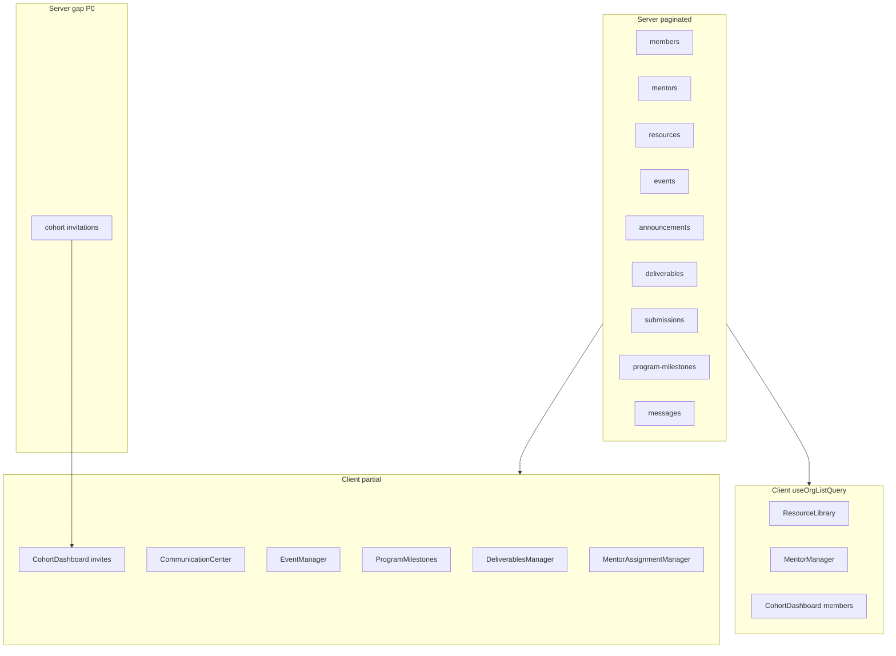

# Pagination audit — Organization module (Step 0.2)

**Date:** 2026-05-18  
**Purpose:** Read-only inventory before Phase 1 ([`CODING_TODO_STEPS.md`](CODING_TODO_STEPS.md) § Phase 1).  
**Standard contract:** `?q`, `?limit` (default 25, max 100), `?skip`, `?sortBy`, `?sortOrder`, optional `?status` → `{ items, total, limit, skip }` via [`paginatedSuccess`](../server/src/utils/listQuery.js).

---

## Summary

| Category | Count |
|----------|------:|
| Org list routes **paginated on server** | 9 |
| Org list routes **not paginated** (gaps) | 4 |
| Client surfaces **fully wired** (`useOrgListQuery` + `*Page` API) | 3 |
| Client surfaces **partial** (API supports paging; UI does not or uses raw fetch) | 7 |
| **P0 gap** (blocks correct admin UX at scale) | 1 (cohort invitations) |

**Silent truncation risk:** Several components call paginated endpoints **without** `limit` / `skip`, so the server returns only the **first 25 rows** ([`DEFAULT_LIMIT`](../server/src/utils/listQuery.js)). Users see an incomplete list with no “load more” control.

---

## Backend matrix

### Paginated (Step 3.1 done on server)

| Method | Path | Handler | Search (`?q`) | Notes |
|--------|------|---------|---------------|--------|
| GET | `/cohorts/:cohortId/members` | `getCohortMembers` | Yes (startup/founder fields) | HTTP smoke: members `?q=Alpha` |
| GET | `/organizations/:orgId/mentors` | `listOrganizationMentors` | Yes | |
| GET | `/cohorts/:cohortId/resources` | `listCohortResources` | Yes (title, description) | Extra: `?category`, `?type` via list options |
| GET | `/cohorts/:cohortId/events` | `listCohortEvents` | Yes | |
| GET | `/cohorts/:cohortId/announcements` | `listCohortAnnouncements` | Yes | |
| GET | `/cohorts/:cohortId/deliverables` | `getCohortDeliverables` | Yes | `?includeArchived=1` supported |
| GET | `/deliverables/:deliverableId/submissions` | `getSubmissions` | Yes | |
| GET | `/cohorts/:cohortId/program-milestones` | `getProgramMilestonesByCohort` | Yes | `?status` maps to category filter |
| GET | `/messages/organization/:organizationId` | `listOrganizationMessages` | Yes | Scoped by role in controller |

**Regression:** Part 2 of [`server/scripts/step_3_1_list_query_smoke.mjs`](../server/scripts/step_3_1_list_query_smoke.mjs) (`RUN_LIST_QUERY_HTTP_FLOWS=1`) covers all rows above **except invitations**.

### Not paginated (gaps)

| Priority | Method | Path | Handler | Current response | Phase 1 action |
|----------|--------|------|---------|------------------|----------------|
| **P0** | GET | `/cohorts/:cohortId/invitations` | `listCohortInvitations` | `{ invitations: [...] }` full array | Add `parseListQuery` + `paginatedSuccess`; keep `?status=` filter |
| **P2** | GET | `/cohorts/organization/:orgId` | `getCohortsByOrganization` | Array of cohorts + `stats` | Defer unless orgs have many cohorts; optional later |
| **P2** | GET | `/organizations/user/:userId` | `getOrganizationsByUser` | Array of organizations | Defer (typically 1–few per user) |
| **P2** | GET | `/organizations/:orgId/admins` | `getOrganizationAdmins` | Array of admins | Defer (small cardinality) |

### Out of scope (non–org-admin list endpoints)

These return full lists but are **not** part of the org dashboard Step 3.1 checklist (founder/talent flows):

- `GET /invitations/founder/:founderId`, talent invitation lists, interests lists — [`invitations.controller.js`](../server/src/controllers/invitations.controller.js)

---

## Frontend matrix

### Fully wired — `useOrgListQuery` + `organizationApi` `*Page` helpers

| Component | API helper | Search UI | Pagination UI |
|-----------|------------|-----------|-----------------|
| [`ResourceLibrary.jsx`](../client/src/components/organizations/ResourceLibrary.jsx) | `getCohortResourcesPage` | Yes | Yes |
| [`MentorManager.jsx`](../client/src/components/organizations/MentorManager.jsx) | `getOrganizationMentorsPage` | Yes | Yes |
| [`CohortDashboardWithSidebar.jsx`](../client/src/components/organizations/CohortDashboardWithSidebar.jsx) (members tab) | `getCohortMembersPage` | Yes | Yes |

Shared hook: [`useOrgListQuery.js`](../client/src/hooks/useOrgListQuery.js) (debounced `q`, `limit`, `skip`).

### Partial — backend paginated; client gap

| Component | Current fetch | Query params sent | Issue | Phase 1 files |
|-----------|---------------|-------------------|--------|----------------|
| [`DeliverablesManager.jsx`](../client/src/components/organizations/DeliverablesManager.jsx) | Raw `fetch` deliverables + submissions | `?includeArchived=1` only on deliverables | Default **limit 25**; no search/paging; submissions unpaginated in UI | Component + optional `getCohortDeliverablesPage` / `getDeliverableSubmissionsPage` |
| [`CommunicationCenter.jsx`](../client/src/components/organizations/CommunicationCenter.jsx) | Raw `fetch` announcements + messages | None | First page only; inbox threads built client-side; mark-read uses full loaded set | Component; `getCohortAnnouncementsPage`, `getOrganizationMessagesPage` |
| [`EventManager.jsx`](../client/src/components/organizations/EventManager.jsx) | Raw `fetch` events | None | First page only; calendar filters client-side | Component; `getCohortEventsPage` |
| [`ProgramMilestones.jsx`](../client/src/components/organizations/ProgramMilestones.jsx) | Raw `fetch` milestones | None | First page only | Component; `getProgramMilestonesPage` |
| [`CohortDashboardWithSidebar.jsx`](../client/src/components/organizations/CohortDashboardWithSidebar.jsx) (pending invites) | `listCohortInvitations` | `?status=pending` only | Unpaginated API; full array expected | After P0 backend: `listCohortInvitations` in [`organizationApi.js`](../client/src/utils/api/organizationApi.js) + members tab |
| [`MentorAssignmentManager.jsx`](../client/src/components/organizations/MentorAssignmentManager.jsx) | Raw `fetch` mentors + members | Members: `limit=100`, optional `q` | Mentors: default 25 only; **duplicate** client `.filter()` on founders after server `q` | Component; reuse `getOrganizationMentorsPage` + `getCohortMembersPage` |
| [`OrganizationAgenda.jsx`](../client/src/components/organizations/OrganizationAgenda.jsx) | Raw `fetch` cohort events | None | Same as EventManager (first 25) | Optional: share `getCohortEventsPage` with EventManager |
| [`CohortDashboardWithSidebar.jsx`](../client/src/components/organizations/CohortDashboardWithSidebar.jsx) (communication tab) | `getCohortMembersPage({ limit: 100 })` | No | One-shot load for recipient picker; OK for v1 if ≤100 members | Optional: raise limit or search when messaging |

### Client-only filtering (not server list pagination)

| Component | Behavior | Phase 1 |
|-----------|----------|---------|
| [`PortfolioOverview.jsx`](../client/src/components/organizations/PortfolioOverview.jsx) | Filters loaded portfolio array by health status | N/A (analytics view) |
| [`EventManager.jsx`](../client/src/components/organizations/EventManager.jsx) / [`OrganizationAgenda.jsx`](../client/src/components/organizations/OrganizationAgenda.jsx) | Date/upcoming filters on loaded events | Address by server-backed event list + paging |

### API helpers already exist (unused by checklist UIs)

Defined in [`organizationApi.js`](../client/src/utils/api/organizationApi.js):

- `getCohortDeliverablesPage`
- `getDeliverableSubmissionsPage`
- `getCohortEventsPage`
- `getCohortAnnouncementsPage`
- `getProgramMilestonesPage`
- `getOrganizationMessagesPage`

Phase 1 should **wire these** rather than invent new clients.

---

## Phase 1 implementation order

Maps to [`CODING_TODO_STEPS.md`](CODING_TODO_STEPS.md) Phase 1.

| Step | Work | Backend files | Frontend files |
|------|------|---------------|----------------|
| **1.1** | Paginate cohort invitations | [`invitations.controller.js`](../server/src/controllers/invitations.controller.js) | [`organizationApi.js`](../client/src/utils/api/organizationApi.js), [`CohortDashboardWithSidebar.jsx`](../client/src/components/organizations/CohortDashboardWithSidebar.jsx) |
| **1.2** | Extend HTTP smoke for invitations | [`step_3_1_list_query_smoke.mjs`](../server/scripts/step_3_1_list_query_smoke.mjs) or new `step_3_1_invitations_list_smoke.mjs` | — |
| **1.3a** | Deliverables list + submissions | — (already paginated) | [`DeliverablesManager.jsx`](../client/src/components/organizations/DeliverablesManager.jsx) |
| **1.3b** | Communication messages + announcements tabs | — | [`CommunicationCenter.jsx`](../client/src/components/organizations/CommunicationCenter.jsx) |
| **1.3c** | Events | — | [`EventManager.jsx`](../client/src/components/organizations/EventManager.jsx), optionally [`OrganizationAgenda.jsx`](../client/src/components/organizations/OrganizationAgenda.jsx) |
| **1.3d** | Program milestones | — | [`ProgramMilestones.jsx`](../client/src/components/organizations/ProgramMilestones.jsx) |
| **1.4** | Mentor assignment manager | — | [`MentorAssignmentManager.jsx`](../client/src/components/organizations/MentorAssignmentManager.jsx) — remove redundant client filter; use `*Page` helpers |
| **1.5** | Mongo text indexes (optional) | Models: Resource, Deliverable, Event, ProgramMilestone, Announcement | Done: [`ensure-search-indexes.mjs`](../server/scripts/ensure-search-indexes.mjs), [`searchIndexManifest.js`](../server/src/db/searchIndexManifest.js); runbook in [`PRODUCTION_READINESS.md`](PRODUCTION_READINESS.md) |
| **Defer** | Org/cohort/admin enumerations | `getCohortsByOrganization`, `getOrganizationsByUser`, `getOrganizationAdmins` | — |

---

## Verification commands (Phase 1)

From `server/`:

```bash
# List query utilities (no Mongo)
npm run test:step-3-1-list-query

# Existing org lists (Mongo + .env.local)
RUN_LIST_QUERY_HTTP_FLOWS=1 npm run test:step-3-1-list-query

# Full org Part 1 bundle
npm run test:org-integration

# After 1.1 — add invitations to HTTP smoke, then:
RUN_ORG_INTEGRATION_HTTP=1 npm run test:org-integration
```

Client after UI changes:

```bash
cd client && npm run build
```

---

## Diagram



---

## References

- Integration plan Step 3.1: [`ORGANIZATION_API_INTEGRATION_PLAN.md`](ORGANIZATION_API_INTEGRATION_PLAN.md)
- Launch checklist: [`LAUNCH_REMAINING_WORK.md`](LAUNCH_REMAINING_WORK.md) (O4)
- List utilities: [`server/src/utils/listQuery.js`](../server/src/utils/listQuery.js)
