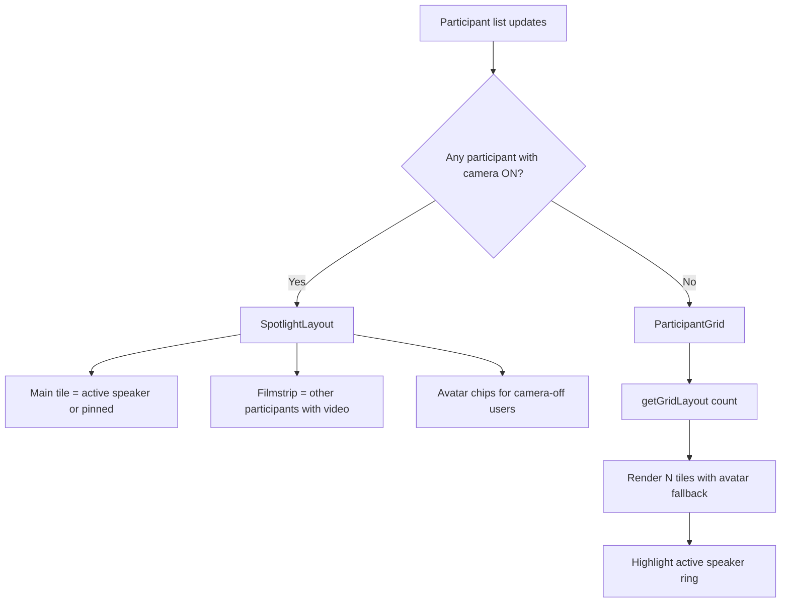

# Video & Voice Call UI — Implementation Plan

**Branch:** `feat/video-voice-call`  
**Status:** Phase 0 locked — ready for implementation  
**Last updated:** 2026-06-15

---

## 0. Decision lock (Q&A — 2026-06-15)

| # | Topic | Decision |
|---|-------|----------|
| Q1 | Messaging → call entry | Same `CallRoom` shell; wire `MessagingSystem` in a **follow-up slice** after team call UI |
| Q2 | Calendar deep-link | **Out of scope** — calendar remains metadata-only |
| Q3 | In-call chat | **Ephemeral** via LiveKit data channel |
| Q4 | Default side panel tab | **Participants** |
| Q5 | Screen sharing | **Yes — v1** |
| Q6 | Call recording | **Defer** |
| Q7 | Live transcription | **Defer** |
| Q8 | Mid-call invite | **Yes — v1** (targeted invite; expands backend/socket scope) |
| Q9 | Minimize to PiP | **Phase 3** if time allows |
| Q10 | Fullscreen layout | **Full takeover** — hide `VerticalSidebar` |
| Q11 | Mobile side panel | **Drawer** / `office-sheet-content` pattern |
| Q12 | Voice-only calls | **Same shell** — hide video controls when `callType === "voice"` |
| Op1 | Custom layout | **Agree** — replace stock `VideoConference` with custom `CallShell` |
| Op2 | Hybrid layout | **Agree** — spotlight when any camera on; grid when all off |
| Op3 | Grid algorithm | **Agree** — `getGridLayout(count, viewport)` as specified |
| Op4 | Chat UI approach | **Minimal custom** in-call chat UI (not full `ChatComposer` / `MessagingSystem` embed) |
| Op5 | Orphan components | **Consolidate** — delete/archive mocks after new UI ships |
| Op6 | Backend fixes | **Same branch** — end room on leave, scope socket events, real presence |
| Op7 | Visual style | **Agree** — cinema-dark stage + light StartupVerse chrome |

### Deviations from original recommendations

- **Q8 (mid-call invite):** Moved into v1 — requires invite UI, targeted socket/LiveKit participant flow (not broadcast-only).
- **Op4 (chat UI):** Minimal custom UI instead of reusing `chatStyles.js` + `ChatComposer` — still ephemeral data channel; lighter dependency on messaging module.

---

## 1. Goal

Redesign the StartupVerse in-app calling experience so it feels native to the product—not a generic LiveKit embed or a third-party meeting clone. The target layout is inspired by the attached reference mockups, adapted to StartupVerse tokens, components, and scope.

### Reference intent (what to take from the mockups)

| Reference | What to borrow | What to ignore |
|-----------|----------------|----------------|
| **Primary layout** (spotlight + side rail + controls) | Fullscreen call shell, header with call title + participant count, main stage area, right panel with Messages / Participants tabs, bottom control bar, optional thumbnail strip for active video, **mid-call invite** | Left app icon rail (StartupVerse already has `VerticalSidebar`), REC timer, live transcription, poll widgets, volume slider overlay |
| **Camera-off grid** | Dynamic participant tiles, name labels, active-speaker green border, silhouette/avatar fallback when video is off | Hamburger + OS window chrome (minimize/close), generic “Username N” placeholders |

### Design principle

> **Cinema-dark stage, light chrome.** The video area uses a dark surface (`slate-900` / `bg-black`) for focus; controls, side panel, and header use StartupVerse light tokens (`--primary`, `--surface-card`, `border-surface-border`, Sora + IBM Plex Sans). This matches `FUTURE_DARK_MODE.md` guidance for video surfaces.

---

## 2. Current state (baseline)

| Area | Today | Gap |
|------|-------|-----|
| **Production path** | Virtual Office → `TeamCallModal` → fullscreen `CallRoom` (LiveKit) | Only entry point; uses default `VideoConference` for video |
| **Video UI** | LiveKit stock `VideoConference` | No custom grid, no camera-off layout, no side chat |
| **Voice UI** | Custom `VoiceCallUI` in `CallRoom.jsx` | Legacy purple `#5B5BD6`, simple wrap grid, no side panel |
| **In-call chat** | None | Mock toggles exist in orphaned components only |
| **Messaging → call** | `MessagingSystem` has video button | `onStartVideoCall` not wired from Dashboard |
| **Orphan UI** | `VideoCallSystem`, `FloatingVideoCall`, `VideoCallOverlay`, `VideoCallModal` | Duplication, not connected to LiveKit |
| **Backend** | LiveKit JWT + Socket.IO `call:started` / `call:ended` | No call-scoped chat API; data channel enabled but unused |

**Integration point for all new work:** `client/src/components/calls/CallRoom.jsx` and its parent `VirtualStartupOfficeWorkspaceV2.jsx`.

---

## 3. Open questions (resolved — see §0)

All questions answered via planning Q&A on 2026-06-15. Retained below for reference.

### 3.1 Call entry points

| # | Question | Default recommendation if no answer |
|---|----------|--------------------------------------|
| Q1 | Should **1:1 calls from Messaging** (DM thread video button) launch the same `CallRoom` shell, or is Virtual Office team call the only entry for this sprint? | Same shell; wire `MessagingSystem` → `CallRoom` in a follow-up slice after team call UI lands |
| Q2 | Should **scheduled calendar `video-call` meetings** deep-link into LiveKit, or stay out of scope? | Out of scope for this branch; calendar remains metadata-only |

### 3.2 In-call chat behavior

| # | Question | Options |
|---|----------|---------|
| Q3 | Is in-call chat **ephemeral** (messages disappear when call ends) or **persisted** in the existing team chat thread? | **Option A (recommended):** Ephemeral via LiveKit data channel — scoped to the room, no DB writes, fastest to ship. **Option B:** Mirror messages into team `MessagingSystem` thread — persists but needs startup/conversation context on every call. **Option C:** Hybrid — ephemeral in UI with optional “save to team chat” later. |
| Q4 | Should the side panel default to **Messages** or **Participants** on join? | Participants if >4 people; Messages if ≤4 (or always Participants — product call) |

### 3.3 Feature scope (from mockup extras)

| # | Question | Recommendation |
|---|----------|----------------|
| Q5 | **Screen sharing** in v1? | Yes — LiveKit supports it; include in control bar |
| Q6 | **Call recording**? | No — marketing-only today; defer |
| Q7 | **Live transcription / captions**? | No — defer |
| Q8 | **Invite mid-call** (“add user”)? | **Yes — v1** (locked) |
| Q9 | **Minimize to PiP** (floating call while browsing office)? | Nice-to-have; `FloatingVideoCall.jsx` exists as reference — include in Phase 3 if time allows |

### 3.4 Layout & platform

| # | Question | Recommendation |
|---|----------|----------------|
| Q10 | Fullscreen call: **hide** `VerticalSidebar` entirely or keep a slim rail? | Full takeover (`fixed inset-0 z-[999]`) — matches current behavior; no duplicate nav |
| Q11 | **Mobile** layout: side panel becomes bottom sheet? | Yes — reuse `Drawer` / `office-sheet-content` pattern from `TeamHubPanel` |
| Q12 | **Voice-only** calls: same shell (dark stage + avatar grid) or lighter voice-specific layout? | Same shell for consistency; video controls hidden when `callType === "voice"` |

---

## 4. Opinions & recommended options

### 4.1 Replace `VideoConference` with a custom LiveKit layout

**Recommendation:** Build a custom `CallShell` using `@livekit/components-react` hooks (`useParticipants`, `useTracks`, `VideoTrack`, `AudioTrack`, `useSpeakingParticipants`).

**Why:** Stock `VideoConference` cannot deliver the camera-off grid, StartupVerse styling, or integrated side panel. Custom layout is standard for LiveKit apps and keeps one code path for voice + video.

**Risk:** More code than default component. Mitigate by wrapping LiveKit primitives, not reimplementing WebRTC.

### 4.2 Hybrid stage layout (not purely grid or purely spotlight)

**Recommendation:** Use **layout mode switching** based on participant video state:

```
IF any remote participant has camera ON:
  → Spotlight layout (ref: primary mockup)
     - Large main tile (active speaker or pinned)
     - Vertical/horizontal filmstrip of other video tiles
     - Camera-off participants appear as small avatar chips on filmstrip OR in grid section

ELSE (all cameras off):
  → Dynamic grid layout (ref: camera-off mockup)
     - Responsive grid driven by participant count
     - Active speaker: green ring (`ring-2 ring-status-success` or `#00c896`)
     - Tile: dark card, avatar silhouette or user initials, name top-left
```

This matches both references without awkward empty video frames.

### 4.3 Dynamic grid algorithm

**Recommendation:** Implement a small pure function `getGridLayout(count, viewport)` returning CSS grid template + tile aspect rules.

| Participants | Desktop layout | Mobile layout |
|--------------|----------------|---------------|
| 1 | Single centered tile | Full width |
| 2 | 1×2 or 2×1 based on aspect | Stacked |
| 3 | 2+1 (one large left, two stacked right) — matches ref mockup | 2+1 or vertical stack |
| 4 | 2×2 | 2×2 |
| 5–6 | 3×2 or 2×3 | 2×3 |
| 7–9 | 3×3 | 2×4 with scroll |
| 10+ | 3×N with `ScrollArea`, max visible 12 per “page” + overflow indicator | 2×N scroll |

Use `ResizeObserver` or container queries so tiles reflow on resize. Prefer `aspect-video` when any camera is on; `aspect-square` or flexible height for avatar-only tiles.

### 4.4 In-call chat: LiveKit data channel first

**Recommendation:** Option A (ephemeral data channel) for v1.

- Token already grants `canPublishData: true`
- No new REST endpoints for MVP
- Reuse `ChatComposer` + bubble styles from `chatStyles.js` for visual parity
- Message shape: `{ id, senderId, senderName, text, timestamp }`

**Later:** Bridge to team messaging if product wants persistence.

### 4.5 In-call chat UI (locked: minimal custom)

**Decision:** Build a **minimal custom** in-call chat UI — not a full `ChatComposer` / `MessagingSystem` embed.

Side panel **Messages** tab composes:

- New `CallChatMessageList.jsx` — simple bubbles aligned to StartupVerse tokens (primary sent, white received)
- New lightweight `CallChatInput.jsx` — text-only composer (no attachments/mentions in v1)
- Ephemeral transport via LiveKit data channel (`useCallChat`)

Participants tab: list from `useParticipants()` with mic/camera icons, speaking indicator, local “You” badge.

### 4.6 Consolidate orphan components

**Recommendation:** After new UI ships, **delete or archive** unused mock paths in the same branch (or immediate follow-up PR):

- `VideoCallSystem.jsx` (dashboard mock page)
- `FloatingVideoCall.jsx`, `VideoCallOverlay.jsx`, `VideoCallModal.jsx` — unless PiP is implemented using refactored versions

Keeps one mental model: LiveKit + `CallShell`.

### 4.7 Fix known backend gaps (same branch or fast follow)

| Issue | Fix |
|-------|-----|
| Leave doesn’t end room | Call `POST /calls/end/:roomName` when last participant leaves (or initiator leaves) |
| Global `io.emit` | Scope `call:started` / `call:ended` to startup/team room |
| Presence | Set real `in-meeting` status while in `CallRoom` |

These are not UI but affect call UX quality.

### 4.8 Token alignment cleanup

Replace all `#5B5BD6` / hardcoded grays in `CallRoom.jsx` with `bg-primary`, `text-text-heading`, `border-surface-border`, `bg-status-error` for end-call.

---

## 5. Target architecture

### 5.1 Component tree

```
CallRoom (LiveKitRoom wrapper)
└── CallShell
    ├── CallHeader          — title, back/leave, participant count badge
    ├── CallStage           — flex-1 dark area
    │   ├── SpotlightLayout     (when ≥1 camera on)
    │   └── ParticipantGrid     (when all cameras off)
    ├── CallControlBar      — mic, camera, screen share, end, settings (optional)
    └── CallSidePanel       — Tabs: Messages | Participants
        ├── CallChatPanel       — data channel + ChatComposer
        └── CallParticipantsPanel
```

**Mobile:** `CallSidePanel` → toggle via chat/users icons on control bar; content in `Drawer`.

### 5.2 File plan (new / modified)

| File | Action |
|------|--------|
| `client/src/components/calls/CallRoom.jsx` | Refactor — mount `CallShell` instead of `VideoConference` / inline `VoiceCallUI` |
| `client/src/components/calls/CallShell.jsx` | **New** — layout orchestrator |
| `client/src/components/calls/CallHeader.jsx` | **New** |
| `client/src/components/calls/CallControlBar.jsx` | **New** |
| `client/src/components/calls/CallSidePanel.jsx` | **New** |
| `client/src/components/calls/CallChatPanel.jsx` | **New** |
| `client/src/components/calls/CallParticipantsPanel.jsx` | **New** |
| `client/src/components/calls/ParticipantGrid.jsx` | **New** — camera-off dynamic grid |
| `client/src/components/calls/SpotlightLayout.jsx` | **New** — main + filmstrip |
| `client/src/components/calls/ParticipantTile.jsx` | **New** — shared tile (video or avatar) |
| `client/src/components/calls/useCallLayout.js` | **New** — grid algorithm + layout mode |
| `client/src/components/calls/useCallChat.js` | **New** — LiveKit data channel send/receive |
| `client/src/components/calls/callStyles.js` | **New** — tokens for dark stage + control bar (like `chatStyles.js`) |
| `client/src/components/office/VirtualStartupOfficeWorkspaceV2.jsx` | Pass call metadata (title, startup name) into `CallRoom` |
| `client/src/components/messaging/MessagingSystem.jsx` | (Phase 2) Wire `onStartVideoCall` |

### 5.3 Visual spec (StartupVerse-adapted)

| Element | Spec |
|---------|------|
| **Stage background** | `bg-slate-900` or `#0d0d14` |
| **Avatar-off tile** | `bg-slate-800 rounded-card`, initials in `bg-primary` circle or generic silhouette icon |
| **Active speaker** | `ring-2 ring-[#00c896]` (status success) |
| **Header** | `bg-white border-b border-surface-border`, Sora title, muted participant pill |
| **Control bar** | `bg-white/95 backdrop-blur border-t border-surface-border`, icon buttons `rounded-full h-11 w-11` |
| **End call** | `bg-status-error text-white rounded-full` — prominent center button |
| **Side panel** | `office-panel-shell` styling, width `min(380px, 40vw)`, tabs like shadcn `Tabs` |
| **Chat bubbles** | Reuse `bubbleClass` from `chatStyles.js` |

---

## 6. Implementation phases

### Phase 0 — Decision lock (this document)

- [x] Answers to §3 open questions (see §0)
- [x] Confirm in-scope / out-of-scope feature list
- [x] Sign-off on hybrid layout approach

### Phase 1 — Call shell & grid (MVP visual)

**Goal:** Replace `VideoConference` with custom layout; camera-off grid works for all participant counts.

- [ ] Create `callStyles.js` + `CallShell` scaffold
- [ ] Implement `ParticipantTile` (avatar fallback + optional `VideoTrack`)
- [ ] Implement `useCallLayout` + `ParticipantGrid` with responsive breakpoints
- [ ] Active speaker detection via `useSpeakingParticipants`
- [ ] Unified `CallControlBar` (mic, camera, leave) — hide camera for voice calls
- [ ] Migrate voice call UI into same shell (remove legacy `VoiceCallUI` block)
- [ ] `CallHeader` with room name + participant count
- [ ] Token cleanup (`#5B5BD6` → design tokens)

**Exit criteria:** Team video + voice call from Virtual Office looks on-brand; all-camera-off shows dynamic grid; at least one camera on shows spotlight + strip.

### Phase 2 — Side panel chat & participants

**Goal:** In-call Messages + Participants tabs.

- [ ] `useCallChat` — encode/decode JSON on LiveKit data channel
- [ ] `CallChatPanel` — message list + minimal `CallChatInput`
- [ ] Mid-call invite UI + targeted join flow (§0 Q8)
- [ ] `CallParticipantsPanel` — mic/camera/speaking state
- [ ] `CallSidePanel` with tabs; collapsible on narrow viewports
- [ ] Mobile: drawer trigger from control bar

**Exit criteria:** Participants can exchange text during call; panel matches team chat visual language.

### Phase 3 — Polish & integrations

- [ ] Screen share button (LiveKit `useTrackToggle` / screen share API)
- [ ] Call `POST /calls/end/:roomName` on leave
- [ ] Optional: minimize to PiP (`FloatingVideoCall` pattern)
- [ ] Wire `MessagingSystem` → `CallRoom` for 1:1
- [ ] Remove or redirect mock `VideoCallSystem` dashboard page
- [ ] Scope socket events to startup team
- [ ] Update presence to `in-meeting` during call

### Phase 4 — QA & accessibility

- [ ] Keyboard: mute (M), camera (V), leave (Esc confirm)
- [ ] Screen reader labels on all controls
- [ ] Test grids for 1–12 participants at mobile / tablet / desktop widths
- [ ] Test voice-only, video-on, mixed camera on/off
- [ ] Test reconnect after network blip (LiveKit default behavior)

---

## 7. Out of scope (explicit)

- Call recording & playback
- Live transcription / captions
- In-call polls / reactions (unless added later)
- Google Meet path (`/join/:roomName`, mentor instant meet)
- Calendar → LiveKit room auto-creation
- Organization-admin calling
- New WebRTC stack (stay on LiveKit)

**In scope (locked):** mid-call targeted invite (§0 Q8), screen sharing v1 (§0 Q5)

---

## 8. Risks & mitigations

| Risk | Mitigation |
|------|------------|
| Custom layout bugs (tile overlap, wrong speaker) | Unit test `getGridLayout()`; manual QA matrix for N participants |
| Data channel chat lost on reconnect | Show “reconnected — earlier messages not shown” banner |
| Performance with 12+ video tracks | Limit simultaneous video subscriptions; avatar mode for off-camera |
| z-index conflicts with office panels | Keep call at `z-[999]`, side panel inside shell, modals at `1000+` |
| Scope creep from mockup | §7 out-of-scope list; §3 questions require explicit yes to add |

---

## 9. Success metrics

- [ ] Call UI uses StartupVerse tokens (no legacy purple)
- [ ] Camera-off grid reflows correctly for 1–12 participants on mobile and desktop
- [ ] Active speaker visually indicated
- [ ] In-call chat works between all participants in the same room
- [ ] Voice and video share one shell
- [ ] No regression to existing Virtual Office team call flow (create → join → leave)

---

## 10. References

- Production entry: `client/src/components/office/VirtualStartupOfficeWorkspaceV2.jsx`
- LiveKit room: `client/src/components/calls/CallRoom.jsx`
- Pre-call modal (style reference): `client/src/components/calls/TeamCallModal.jsx`
- Chat tokens: `client/src/components/messaging/chatStyles.js`
- Office panel pattern: `client/src/components/office/TeamHubPanel.jsx`
- Design tokens: `client/src/styles/globals.css`
- Attached mockups: primary layout (spotlight + side chat), camera-off grid

---

## Appendix A — Layout mode decision flow



---

## Appendix B — Control bar actions (v1)

| Control | Voice | Video | Notes |
|---------|-------|-------|-------|
| Mute / unmute | ✓ | ✓ | |
| Camera on / off | — | ✓ | |
| Screen share | — | ✓ | Phase 3 |
| Chat panel toggle | ✓ | ✓ | Phase 2 |
| Participants panel | ✓ | ✓ | Phase 2 |
| End call | ✓ | ✓ | Destructive, center emphasis |
| Settings | — | — | Defer (device picker can be Phase 3) |
